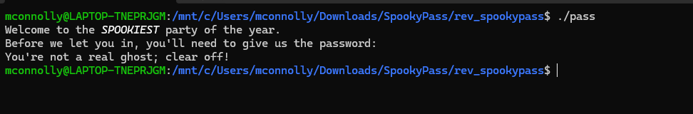

# SpookyPass

For this challenge, we are given a binary that asks for a password:

Before firing up IDA or Ghidra, we first try running the `strings` command on the binary:

From the output, we can see that the password is:
`s3cr3t_p455_f0r_gh05t5_4nd_gh0ul5`

Entering this into the program, we successfully get the flag.

## Lessons Learned

- Always check for **obivious strings** in binary before diving into reverse engineering. 
- Simple challenges may not require full-fledged tools