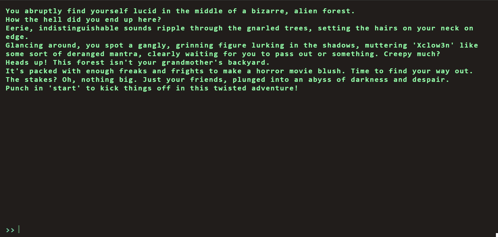
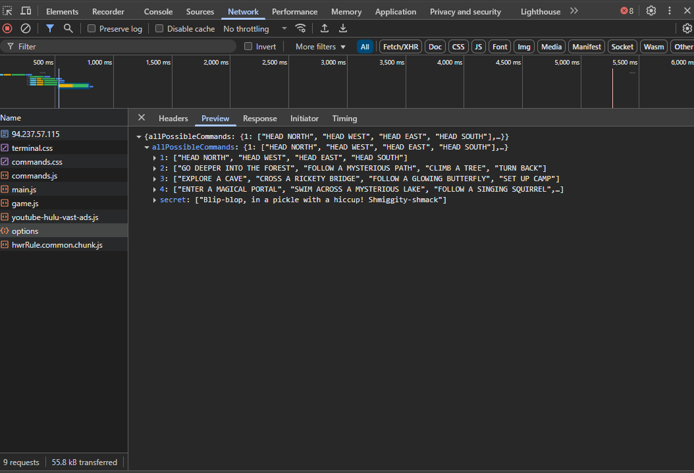
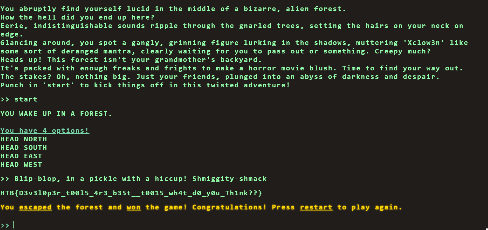

# Flag Command

## Description

Embark on the "Dimensional Escape Quest" where you wake up in a mysterious forest maze that's not quite of this world. Navigate singing squirrels, mischievous nymphs, and grumpy wizards in a whimsical labyrinth that may lead to otherworldly surprises. Will you conquer the enchanted maze or find yourself lost in a different dimension of magical challenges? The journey unfolds in this mystical escape!


## Solution

Opening the application, we see the main page:



By checking the **network tab**, we notice a call to `/options` that reveals all possible commands:



From this list, we identify the secret command:

```Blip-blop, in a pickle with a hiccup! Shmiggity-shmack```

Entering this command into the application, we successfully retrieve the flag:



## Lessons Learned

- Always inspect **network requests** when interacting with web application; hidden endpoints often reveal important information.
