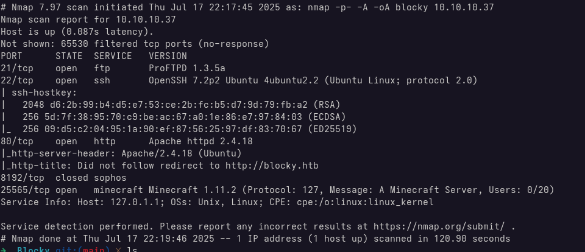
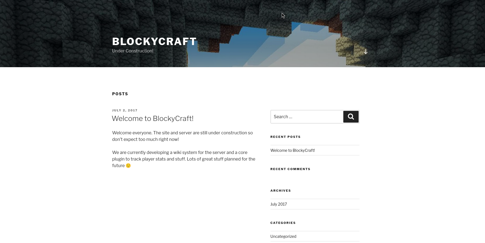
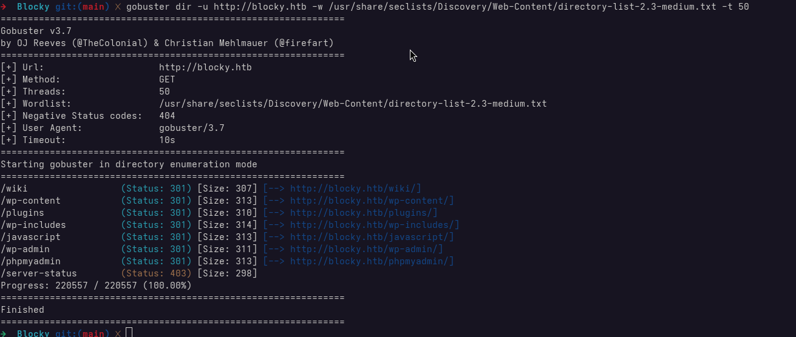
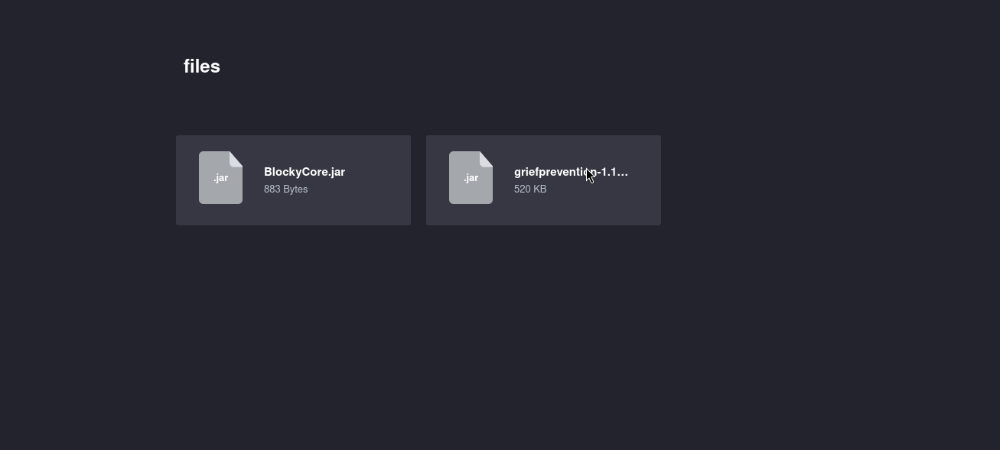
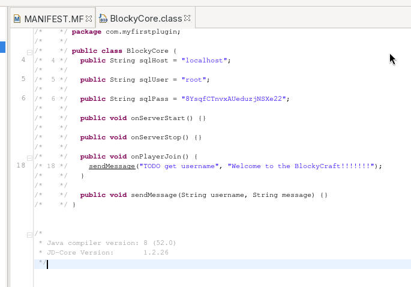
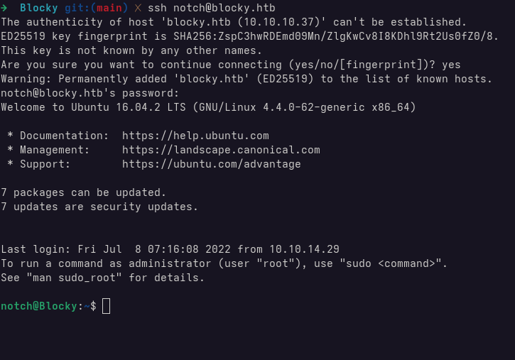
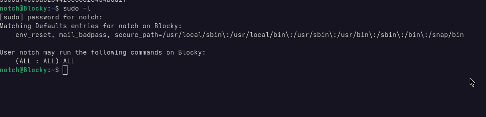
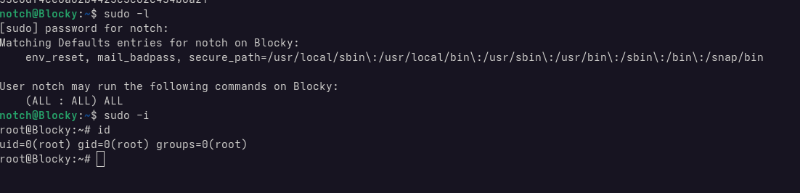

# Scanning & Enumeration

## Nmap Scan

Analysing the nmap scan, we can see four open ports:

- 21(FTP) - File Transfer Protocol
- 22 (SSH) - Secure Shell
- 80 (HTTP) - Web Server
- 25565 (Minecraft) - Minecraft server port

Port 8192 was also detected but appears to be closed, so we'll ignore it for now.

## Web Recon
Since there's a web server running on port 80, the first step is to take a look at the homepage.

From the footer, we can see that the site is powered by **WordPress**

If we click on the blog post, we can see that the author is **notch**.

There's also a mention of a **plugin used to track stats**, which could be worth investigating later.

Next, we'll check for any hidden directories that might reveal more about the site's structure.

### Directory Scanning

Using **Gobuster**, we are able to discover several directories on the server.

Earlier, the homepage mentioned a plugin used to track stats. Based on that, it's reasonable to assume there may be something of interest in the plugin directory.

Inside, we find two `.jar` files. These are likely related to the stats plugin and potentially useful for further analysis. 

## Jar Decompilation

We need to decompile the `.jar` file to check for any hardcoded credentials or hidden logic.

Using `JD-GUI-Duo`, we find a single `.class` file inside the archive.

The decompile code reveals a **username** and **password** for the SQL database.

At this point, we have two possible paths:
* Use the credentials to log into **phpMyAdmin**, which is installed on the web server
* Try the same credentials with the previously discovered user: `notch`

# Explotation

Using the SQL root password with the user `notch`, we're able to successfully SSH into the server.

## User Flag
The user flag is located at `/home/notch/user.txt`

# Privilege Escalation
Running `sudo -l` reveals the following:

The user `notch` has full `sudo` privileges. This means we can simply run `sudo -i` to spawn a root shell.

## Root Flag
The root flag is located at `/root/root.txt`

# Lessons Learned
* Do not use Hardcoded variable
* Do not reuse the same password
* Limit sudoers privilege

