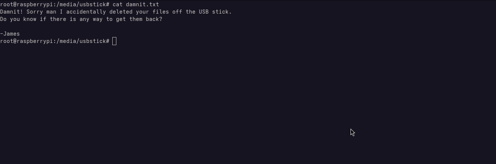

# Machine Info

The name of this machine is inspired by a real-world botnet known as (Mirai)[https://en.wikipedia.org/wiki/Mirai_(malware)].

Mirai is a notorious piece of malware that primarily targets Internet of Things (IoT) devices, such as routers, IP cameras, and digital video recorders. Once a device is infected, it becomes part of a larger botnet that can be remotely controlled to launch large-scale distributed denial-of-service (DDoS) attacks. First discovered in 2016, Mirai made headlines for taking down major websites and servies by overwhelming them with traggic. It exploits default or weak login credentials to gain access to vulnerable devices, making it a powerful example of how poor security hygiene in embedded systems can lead to widespread disruption.

# Scanning and Enumeration

Analysing the nmap scan, we can see six open ports:

- 22 (SSH) - Secure Shell
- 53 (DNS) - Domain Name Service
- 80 (HTTP) - Web Server
- 1508 (UPNP) - Universal Plug and Play
- 32400 (HTTP) - Web Server (Plesk)
- 32469 (UPNP) - Universal Plug and Play

## Web Server
When accessing the root directory of the web server on port 80, we receive the following error:

This indicates that the server is responding, but there's no content being served at the root path. To ensure nothing is hidden, we'll try brute-forcing the directory structure to look for accessible paths or files.

### Directory Brute-Force
Using gobuster, we were able to discover two URLs:

The first leads to an admin panel for Pi-hole, a network-wide ad blocker typically used for DNS filtering. The presence of this panel may suggest default credentials or misconfigurations worth investigating.

The second URL reveals a version number for an unknown piece of software. This could be useful for identifying potential vulnerabilities or outdated components.

# Explotation

From the discovery of the Pi-hole admin panel, we can hypothesize that the machine is likely running `Raspbian`, the default operating system for Raspberry Pi devices.

Raspbian commonly uses the default username and password combination: `pi:raspberry`. Attempting to SSH with these credentials proves successful:

We now have an initial foothold on the machine as the `pi` user.

## The User Flag

The user flag is located at `/home/pi/Desktop/user.txt`.

# Privilege Escalation

First, let's check the `sudo` permissions using `sudo -l`:

We can see that the user `pi` is allowed to execute any command as `root` without a password. This means privilge escalation is straightforward.

By symply running `sudo -i`, we gain a root shell:

We now have root access. Time to hunt for the `root flag`.

## Root Flag

Instead of the root flag, we're met with the following message:

It seems the root flag is missing, but fortunately, there's a backup on a USB stick.

Initially, we checked `/mnt`, but it was empty. Upon further inspection, we found the USB stick mounted at `/media/usbstick`. Inside, there's a text file with the following content:

Bad news, the root flag was deleted from the USB drive. It's time to perform some basic forensics to recover the lost file.

We use the `strings` command directly on the block device `/dev/sdb`, which reperesents the USB stick.

This scans the raw disk for human-readable text, and ...

Success! We've managed to recover the root flag.

# Lessons Learned
* Change default password after installation
* Make proper backups for important files

