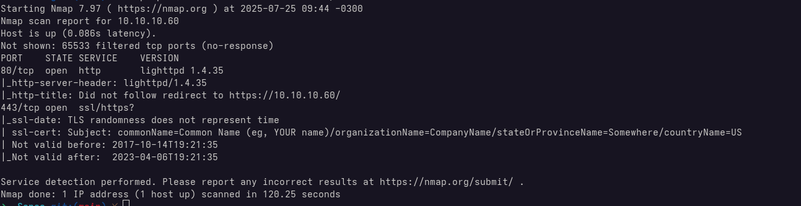
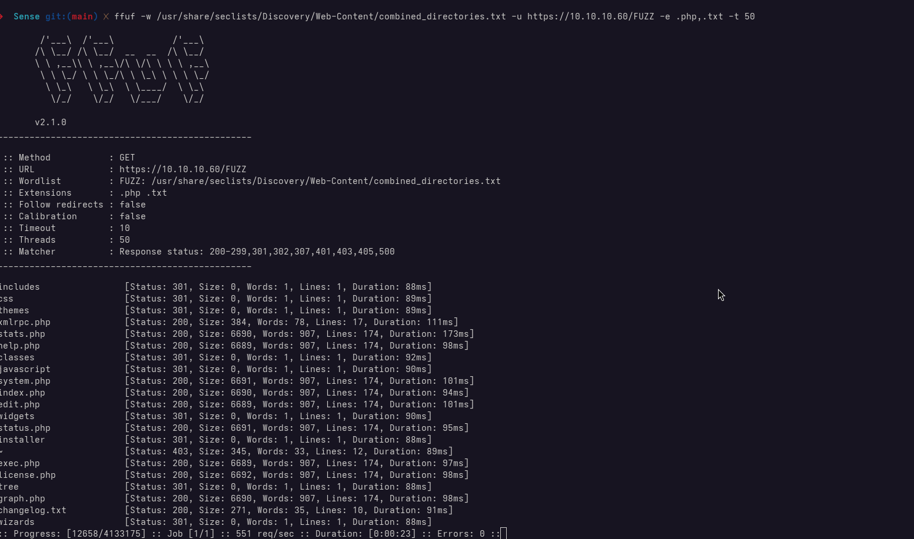
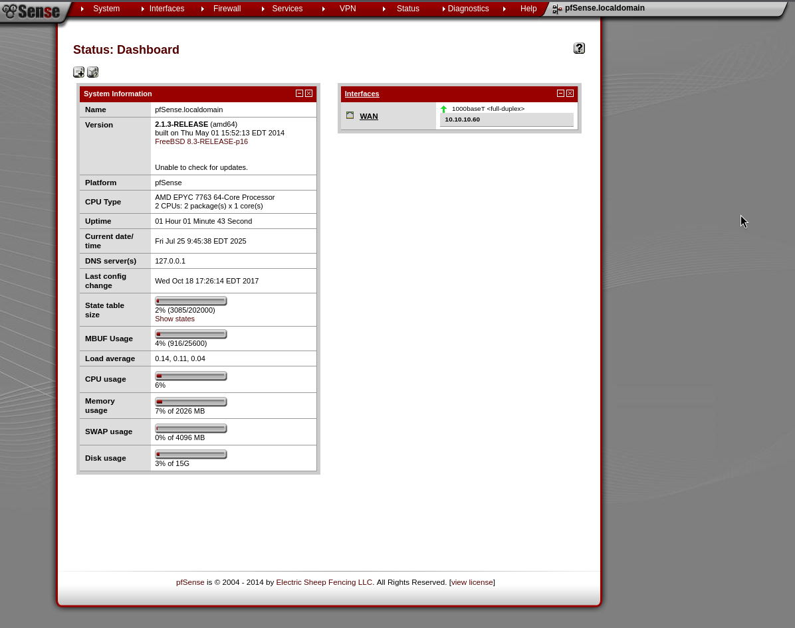
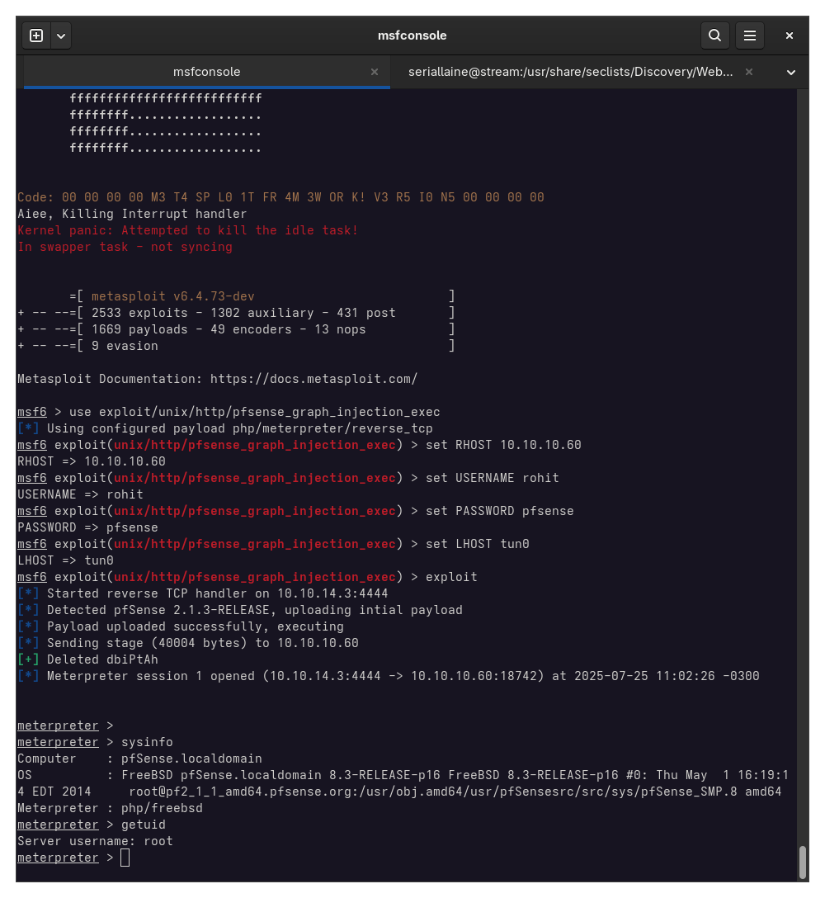

# Scanning & Enemeration

Analysing the nmap scan, we can see two open ports:
- 80 (HTTP) - Web Server
- 443 (HTTPS) - Web Server

## Web Server

By browsing to the web server, we are presented with the following login page

This confirms the server is running pfSense, although the version is not specified.

## Directory Brute-Force

By using ffuf, we discovered two interesting files on the web server:

* changelog.txt - mentions and unpatched vulnerability in the system
* system-users.txt - contains login credentials for the pfSense interface

## PfSense Administrative Access
Using the credentials discovered in `system-users.txt`, we successfully logged into the pfSense admin panel:

Once inside, the dashboard revealed we were running pfSense 2.1.3.

# Exploitation

A quick web search led us to a Metasploit module targeting this version.

https://github.com/rapid7/metasploit-framework/blob/master/documentation/modules/exploit/unix/http/pfsense_graph_injection_exec.md

We loaded and configured the module in Metasploit, set the RHOST to our pfSense instance, and ran the exploit.

The payload executed without errors, and we were dropped into a root shell on the pfSense server. From there, retrieving both the user and root flags was trivial. 

# Lessons Learned
* Change the default password after installation
* Update your outdated software