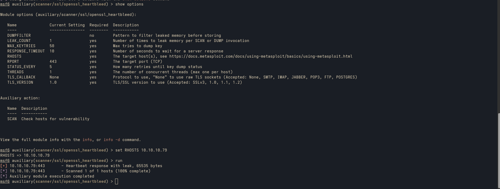

# Scanning and Enumeration

The initial Nmap scan reveals three open ports:

- 22 (SSH) - SSH
- 80 (HTTP) - Web Server
- 443 (HTTPS) - Web Server 

## Web Server (HTTP)

Navigating to the web server on port 80, we are greeted with an image:

## Web Server (HTTPS)

Navigating to the web server on port 443, we see the same image.

The image gives us a subtle hint. There might be something related to **Hearthbleed (CVE-2014-0160)**.

## Scanning for Heartbleed

To confirm, we use the `scanner/ssl/openssl-heartbleed` module in Metasploit.

We confirm that the web server is indeed vulnerable to Hearthbleed.

## Bruteforcing Directory

Next, we use `Gobuster` to brute-force directories and find the following:

We locate a potentially interesting directory named `dev`:

Inside this directory, we find a file called `hype_key`, which piques our interest.

# The hype-key

The `hype_key` file appears to be a hex dump/

Adter decoding the hex into ASCII, we find an encrypted private key. However, we still need to decrypt it.

## Decypting the Private key

At this point, we look for a way to obtain the decryption password. With the Heartbleed vulnerability, we can access the server's memory and search for anything that might give us the password.

Inside the leak, we find the string:
`$text=aGVhcnRibGVlZGJlbGlldmV0aGVoeXBlCg==`

This is a **base64** encoded string, which convert to ASCII reveal the password:

`heartbleedbelievethehype`

We now have the decrypted private key.

# Accessing the server using SSH

With the private key, we can now access the server via SSH:

After logging in, we can retrieve the user flag by running:

`cat flag.txt`

# Privilege Escalation

Upon examining the process list with `ps aux`, we notice that **tmux** is running under the **root** user.

Once inside the session, we gain root access:

Now that we have root access, we can retrieve  the root flag by running:

`cat /root/root.txt`

# Lesson Learned

- Update software
- Do not expose key file to the public
- Memory leaks can be use to expose password that are stored in memory
- Keep an eye on processes running with elevated privileges
