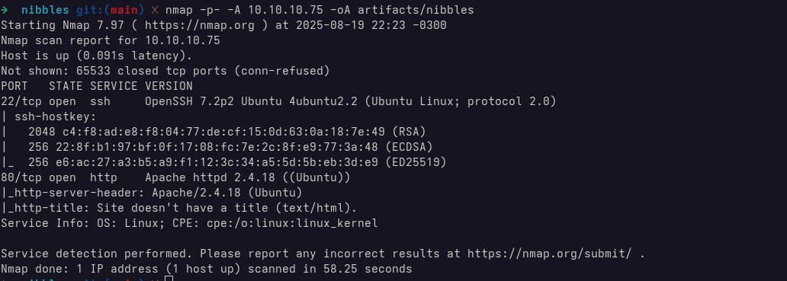
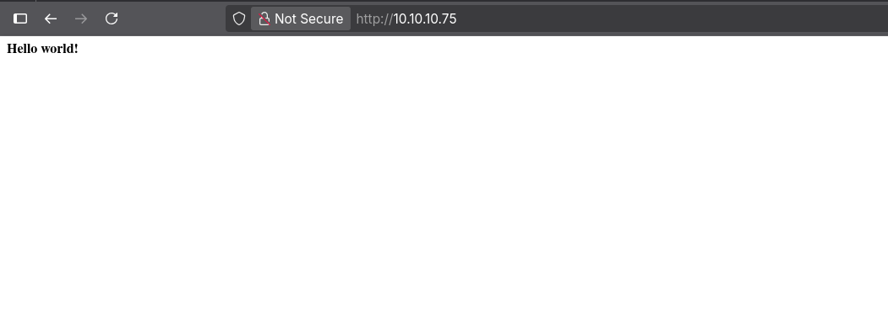
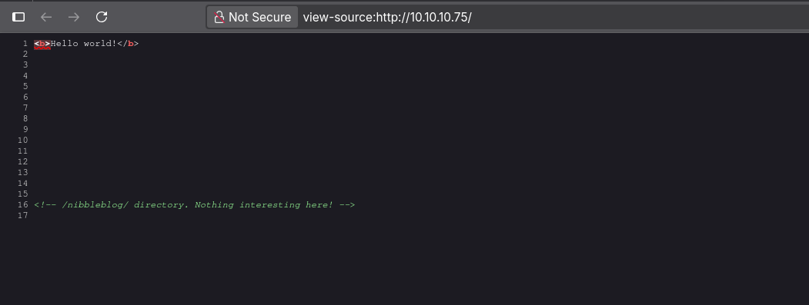
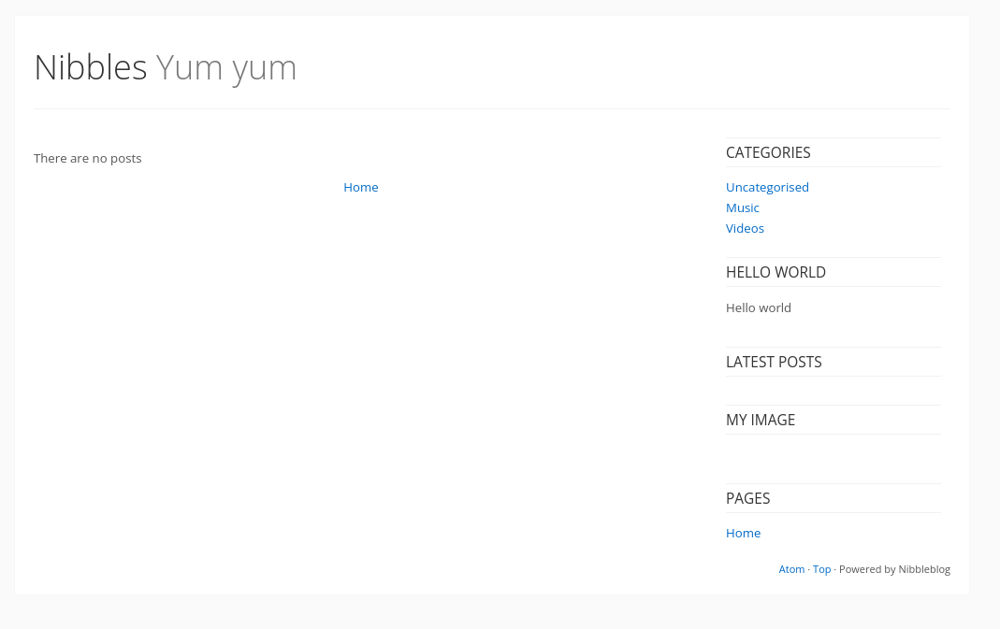
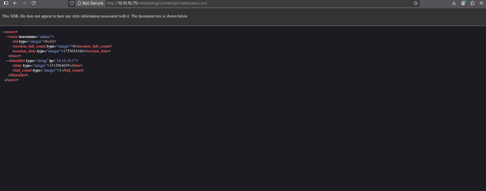
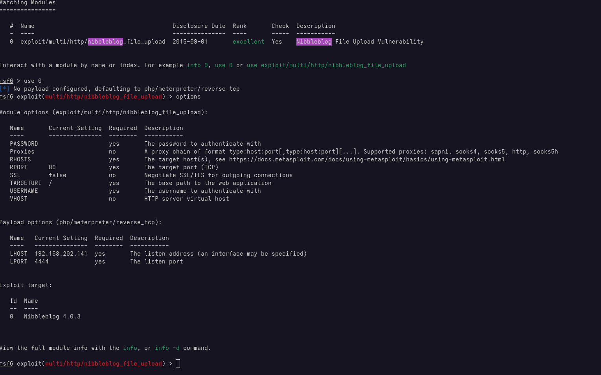
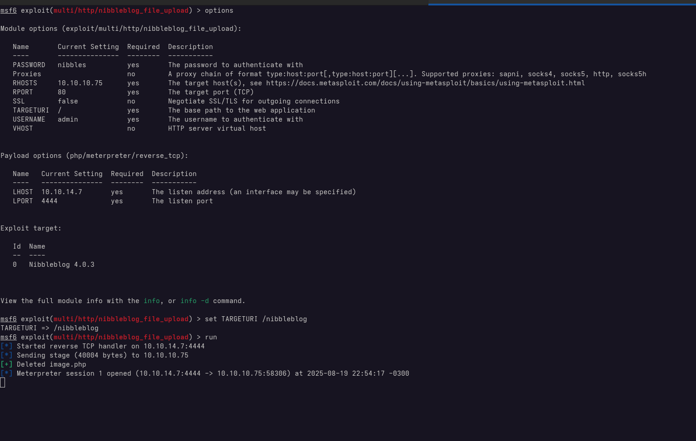
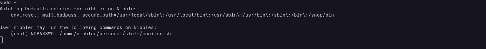

# Scanning and Enumeration

The initial Nmap scan reveals two open ports:

- 22 (SSH) - SSH
- 80 (HTTP) - Web Server

## Web Server

Navigating to the web server on port 80, we're greeted with a simple "Hello World!" message.

Inspecting the page source code reveals a reference to a `/nibbleblog` directory:

Accessing this directory brings us to the Nibbleblog interface

At the bottom of the page, we see the site is powered by **Nibbleblog**, a lightweight CMS written in PHP that is no longer actively maintained.

### Credential Enumeration

Exploring the `/content` directory, we uncover a file containing a **user blacklist**

from this, we learn that the username `admin` is valid.

### Getting the admin password

Since this is an easy box, we tried a few common passwords manually. After a few attempts, we successfully logged in using:

- Username: `admin`
- Password: `nibbles`

# Explotation

A quick search for know vulnerabilities in Nibbleblog leads us to a Metasploit module:

https://www.rapid7.com/db/modules/exploit/multi/http/nibbleblog_file_upload/

This module exploits an **arbitary file upload vulnerability**, allowing an attacker to execute remote code on the server.

After setting the appropriate parameters. We launch the exploit and succesfully obtain a Meterpreter session.

With a foothold on the target machine, we can now begin post-exploitation and privilege escalation.

# Privilege Escalation

We begin post-exploitation by checking for `sudo` permission using `sudo -l`:

We discover that the current user has permissions to run the following script as root without a password: `/home/nibbler/personal/stuff/monitor.sh`

Since we have write access to this file, we can replace its contents with a simple reverse shell. After modifying the script, we execute it using `sudo`, which gives us `root access`:

We now have full control over the system.

# Lessons Learned

- Weak credentials are dangerous
- Legacy software is a Common Attack Vector
- Sudo Misconfiguration Can Lead to Root